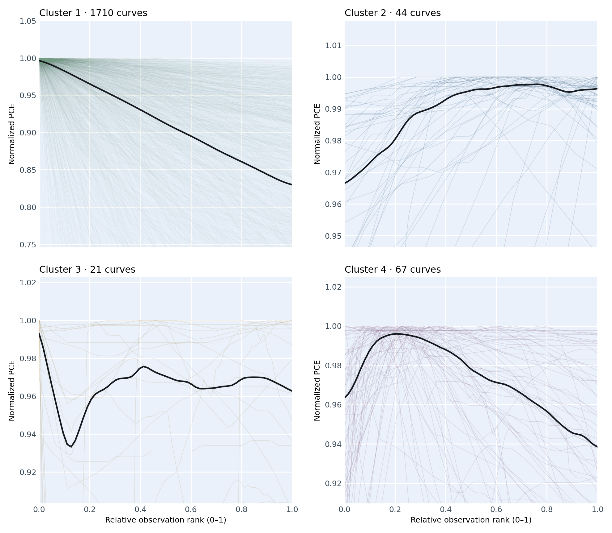

# 钙钛矿太阳能电池早期衰减曲线：四类形状复现

[English](README.md) · [详细方法](docs/WORKFLOW_CN.md)

本仓库整理了论文中提取的 **1842 条钙钛矿太阳能电池稳定性曲线**，探索 **0–200 小时**内的早期变化。现有结果分为四类探索性形状：**Slope、Bridge、Valley、Hill**。

## 核心结果：四簇曲线局部放大图

<a href="results/figures/Supplementary_Fig_S1_zoom.png"></a>

浅色线为单条曲线，黑线为仅供展示的平滑中位趋势。各面板的纵轴分别放大；横轴为**相对观测序位**，不是实际经过的小时数。可[打开矢量图](results/figures/Supplementary_Fig_S1_zoom.svg)，或[浏览单条曲线](results/dashboard.html)。

> **方法说明：**代码从曲线提取 5 个形状特征，再用密度加权 K-means 聚为四簇；**并未实现 SOM（自组织映射）**。输入曲线此前曾借助暂定形状候选筛选，因此四簇不能视作经独立验证的真实类别。

## 目录

| 目录 | 内容 |
| --- | --- |
| [`code/`](code/) | 聚类、核验、绘图、浏览页面生成脚本，以及参数和依赖 |
| [`data/`](data/) | 固定输入索引、0–200 小时观测点、64 点形状输入、原始 CSV 和论文图 |
| [`results/`](results/) | 四簇结果、图片、按簇复制的来源文件及离线[浏览页面](results/dashboard.html) |
| [`docs/`](docs/) | 详细流程与方法边界 |

## 一步步复现

使用 **Python 3.9**。在仓库根目录执行以下命令（macOS/Linux）：

```bash
python3 -m venv .venv
.venv/bin/python -m pip install -r code/requirements.txt
.venv/bin/python code/verify.py
OPENBLAS_NUM_THREADS=1 OMP_NUM_THREADS=1 .venv/bin/python code/run.py
.venv/bin/python code/verify.py --check-results
```

运行会写入 `results/` 并替换其中生成的簇文件夹。预期四簇数量为 **1710／44／21／67**。直接打开 `results/dashboard.html` 可浏览全部曲线和来源图片。参数见 [`code/config.json`](code/config.json)，完整分析步骤见 [`docs/WORKFLOW_CN.md`](docs/WORKFLOW_CN.md)。

**复现范围：**本仓库从已提取、已固定的 1842 条曲线开始，不重新对论文图片进行数字化，也不重新从更大候选池筛选。聚类中的形状轴是观测序位，不是实际经过的小时数。
