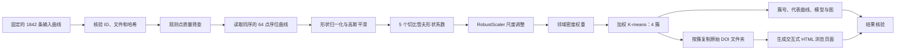

# 1842 条曲线四簇分析：核心 workflow

## 一句话概述

从**已经固定的 1842 条早期归一化 PCE 曲线**出发，先做输入核验和质量筛查，再把每条曲线压缩成 5 个形状特征，按特征空间中的距离进行密度加权 K-means 聚类，最后输出逐曲线簇号、代表曲线、模型数组和图。当前拟合不使用类别标签；Cluster 1–4 仅是探索性的形状分组。



## 1. 固定输入与核验

- `data/input_index.csv` 定义 1842 条曲线的 ID、顺序、来源，以及对应的归一化观测点文件。
- `data/points/` 提供质量筛查用的早期归一化观测点；`data/shape_inputs.npz` 中的 `raw_rank` 是模型直接读取的 **1842 × 64** 序位形状矩阵，两者按曲线 ID 对齐。
- `data/raw_csv/` 与 `data/curve_index.csv` 保留原始提取 CSV、来源和 SHA-256，供追溯；聚类不直接读取这些原始 CSV。
- `python3 code/verify.py` 核验 ID 数量与顺序、原始 CSV 哈希、点文件是否存在，以及 64 点矩阵的形状和有限值。

本包从固定输入开始，**不重新从论文图片数字化曲线，也不重新从更大候选池筛选 1842 条曲线**。

## 2. 观测点质量筛查

对每条曲线，`code/run.py` 从 `data/points/` 读取 `hour` 和 `normalized_pce`。若同一小时有多个点，先取其中位数，再按小时排序。小时仅用于确定原始观测顺序；**实际聚类不使用经过的小时数**。

保留条件同时满足：

1. 不同观测时刻数至少为 **8**。
2. 粗糙度不超过 **3.0**，其中粗糙度为 `相邻观测值绝对差之和 / max(观测值极差, 0.005)`。

本次运行 1842 条全部通过，排除 0 条。筛查只决定哪些曲线进入模型；通过筛查后，模型读取对应的 64 点 `raw_rank`。

## 3. 曲线形状编码

对每条 64 点曲线 `raw_rank`：

1. 用 `(曲线值 − 首点值) / max(曲线极差, 0.01)` 消除起点和振幅差异，保留相对形状。
2. 沿观测序位做一维高斯平滑，`gaussian_rank_sigma = 1.5`。
3. 在从 −1 到 1 的序位轴上拟合 **5 次切比雪夫多项式**；去掉常数项，得到 **5 个形状系数**。
4. 用 `RobustScaler` 和第 10、90 百分位的范围调整这 5 个系数的尺度，得到聚类用的特征向量 `embedding`。

因此，聚类比较的是**标准化后的 5 维形状特征**，不是原始 CSV 的时间轴，也不是直接逐点比较 64 个观测值。

## 4. 密度加权 K-means

先在 5 维特征空间中用**欧氏距离**寻找邻居。每条曲线到第 31 个邻居的距离记为 `radius`；权重为 `radius / 所有 radius 的中位数`，并限制在 **0.2～10**。局部越稀疏，权重通常越高。

随后运行 `KMeans(n_clusters=4, n_init=20, random_state=43)`，将这些权重作为 `sample_weight`。它反复把曲线分给最近的簇中心，并按权重更新中心，优化的目标是：

```text
Σ_i weight_i × ||embedding_i − center[cluster_i]||²
```

`n_init=20` 表示用不同初始中心完整运行 20 次，再选目标值最好的结果；**不是每次运行只迭代 20 步**。本环境使用 scikit-learn 1.6.1，未显式设置的单次最大迭代数为 300、收敛阈值为 0.0001。这里没有学习率，也没有使用 DTW 距离。

## 5. 结果、图和核验

`code/run.py` 将结果写入仓库根目录下的 `results/`：

| 文件 | 内容 |
| --- | --- |
| `cluster_assignments.csv` | 每条曲线的 Cluster 1–4 编号、筛查指标和密度权重 |
| `representatives.csv` | 每簇距离簇中心最近的 5 条代表曲线及簇大小 |
| `model.npz` | 曲线 ID、Cluster 1–4 编号、64 点输入、特征、簇中心及对应编号 `center_cluster`、权重等数组 |
| `summary.json` | 纳入与排除数量、簇大小、输入/配置/代码的 SHA-256 |
| `cluster_four_groups.png` | 四簇曲线和代表曲线概览 |
| `figures/Supplementary_Fig_S1_zoom.png` / `.svg` | 四簇局部放大图 |
| `verify_inputs.json` / `verify_results.json` | 本次复现保存的核验报告 |
| `cluster_1/` ～ `cluster_4/` | 完整复制的原始 DOI 文件夹；`members.csv` 标出属于本簇的曲线 CSV |
| `dashboard.html` / `dashboard_data.json` | 离线交互页面及可核验的逐曲线展示数据 |

放大图由 `code/render_si_zoom.py` 根据**已经完成的拟合**绘制。黑色中位趋势线使用展示用高斯平滑：Cluster 1 的 `sigma=3.0`，其他簇的 `sigma=1.2`；各面板单独缩放纵轴。**这些绘图参数不改变簇号**。

`python3 code/verify.py --check-results` 再检查结果 ID 顺序、模型输入、簇大小、纳入数量和图文件。本次核验通过：Cluster 1、2、3、4 分别有 **1710、44、21、67** 条曲线。

同一个 DOI 文件夹可能包含不同簇的曲线。因此，四个簇目录中可能重复出现同一 DOI 文件夹；完整副本保留原始 CSV、论文图和 replot，而各目录的 `members.csv` 才是该簇曲线的准确清单。结果核验还检查清单、复制的 CSV 哈希和 DOI 文件夹内容是否齐全。

`code/build_dashboard.py` 根据结果和 `data/raw_csv/curve_index.csv` 生成 `results/dashboard.html`。页面提供簇筛选、关键词搜索、逐曲线 DOI、论文图号、文件名中记录的曲线图例、原论文图、replot 图和原始 CSV。命名对应为 **Cluster 1 = Slope、Cluster 2 = Bridge、Cluster 3 = Valley、Cluster 4 = Hill**。页面数据内嵌，双击 HTML 即可离线打开；`dashboard_data.json` 供程序核验。

## 复现命令

在仓库根目录、安装 `code/requirements.txt` 中的依赖后执行：

```bash
python3 code/verify.py
OPENBLAS_NUM_THREADS=1 OMP_NUM_THREADS=1 python3 code/run.py
python3 code/verify.py --check-results
```

实际运行环境及版本见 `results/environment.json`。代码入口为 `code/run.py`，参数集中在 `code/config.json`，核验逻辑在 `code/verify.py`。

## 方法边界

当前四簇拟合阶段不使用类别名称或真实标签，因此**拟合本身是无监督的**。不过，固定输入的先前筛选使用过旧的暂定形状候选，先前的特征与模型选择也受目标信息影响；因此，不能把整个工作流程称为完全独立的无监督发现，也不能将 Cluster 1–4 解释为经独立验证的真实类别或分类准确率。

## 各部分是否属于无监督

这里区分“本次运行有没有用标签拟合”和“此前确定输入、方法时有没有受目标信息影响”。后者受影响，并不等于本次代码训练了一个监督分类器。

| 部分 | 是否属于无监督 | 判断依据 |
| --- | --- | --- |
| 1842 条曲线的先前筛选 | **不能视为完全无监督** | 固定输入曾使用旧的暂定形状候选；本包不重新执行这一步。 |
| 特征与模型方案的先前选择 | **不能视为完全无监督** | 项目记录明确说明先前的选择受目标信息影响；本次只按固定方案复现。 |
| 本次输入核验与观测点质量筛查 | **是，按无标签规则执行** | 检查文件、数值和预设阈值，不读取真实类别；这一步本身不是模型拟合。 |
| 本次 64 点曲线的形状编码与尺度调整 | **是，按无标签规则执行** | 从曲线数值计算 5 个特征，不把类别标签传入计算；所用方案有上一行所述的历史限制。 |
| 邻域密度权重与四簇 K-means 拟合 | **是，无监督拟合** | 权重来自特征空间的邻居距离，K-means 只读取特征和权重，不读取真实类别。 |
| 代表曲线、图和结果核验 | **不适用：不是训练阶段** | 基于已得到的簇号汇总、绘图并检查复现结果；预期簇大小的核对不是独立类别验证。 |

**结论：当前聚类计算是无监督的；整个研究流程不能称为完全独立、从头到尾的无监督发现。**
